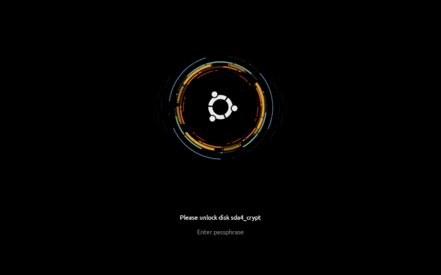
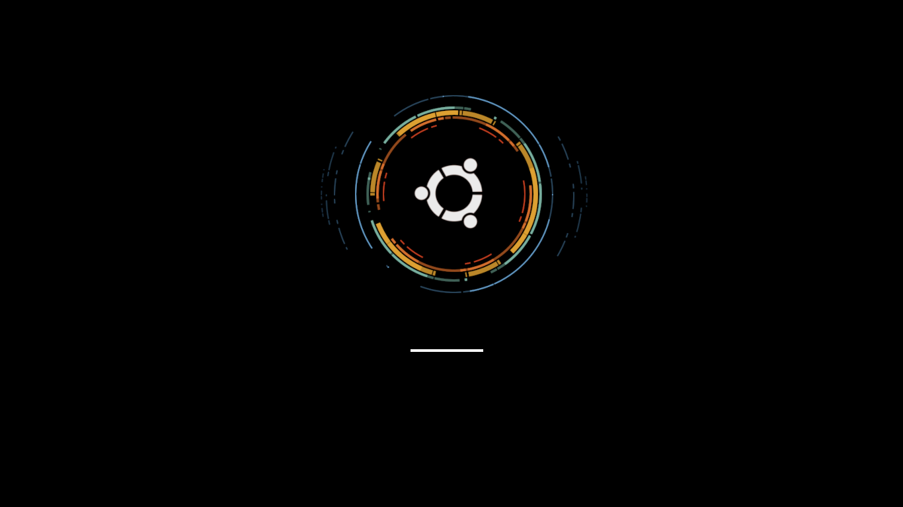

# Vortex Ubuntu

Animated plymouth theme with ubuntu logo and a futuristic and elegant look.

It is a simple plymouth theme with shell scripts to install, test and eventualy uninstall the theme.
the theme have animations that makes the colored strips spin at different velocities with a vortex effect and on boot up it offers a simple but elegant progress bar


### Dependencies

* plymouth, libplymouth5, plymouth-label
* Raccomanded: plymouth-x11
* Install dependencies with `sudo apt install plymouth libplymouth5 plymouth-label`


### Boot up splash screen (GIF)



### Boot up splash screen



### Shutdown splash screen


# Installation


> ### NOTE: apt compatible package coming soon!


* go to the downloaded `vortex-ubuntu-plymouth-theme` folder from terminal, it can be done with the following command
```
cd /PATH/TO/vortex-ubuntu-plymouth-theme
```
or by opening the folder with your file explorer and going to RIGHT-CLICK > Open in Terminal
* make the `install` file executable, it can be done with the following command
```
sudo chmod +x install
```
* execute the `install` file, it can be done with the following command
```
sudo ./install
```


# Test

* go to the downloaded `vortex-ubuntu-plymouth-theme` folder from terminal, it can be done with the following command
```
cd /PATH/TO/vortex-ubuntu-plymouth-theme
```
or by opening the folder with your file explorer and going to RIGHT-CLICK > Open in Terminal
* make the `show-splash.sh` file executable, it can be done with the following command
```
sudo chmod +x show-splash.sh
```
* execute the `show-splash.sh` file, it can be done with the following command
```
sudo ./show-splash.sh
```


# Removal

* go to the downloaded `vortex-ubuntu-plymouth-theme` folder from terminal, it can be done with the following command
```
cd /PATH/TO/vortex-ubuntu-plymouth-theme
```
or by opening the folder with your file explorer and going to RIGHT-CLICK > Open in Terminal
* make the `uninstall` file executable, it can be done with the following command
```
sudo chmod +x uninstall
```
* execute the `uninstall` file, it can be done with the following command
```
sudo ./uninstall
```
* then when asked chose the new plymouth theme by typing the number of your choice and pressing `Enter`


# Customizing background color

* open the file in `vortex-ubuntu/bg.png` in any image editor of your choice

* fill the image with the color you want as background

* save changes ensuring to NOT change neither the file name `bg.png` neither his location `vortex-ubuntu`

* proceed to installation/reinstallation


# Customizing background image

* rename, remove or move to a different folder the file in `vortex-ubuntu/bg.png`

* put your custom background image IN PNG FORMAT inside the `vortex-ubuntu` folder

* rename your custom beckground image as `bg.png`

* proceed to installation/reinstallation


## License


This project is licensed under the GPL v.2 License - see the LICENSE.md file for details


## Acknowledgments

Inspiration, code snippets, etc.
* [Inspiration for estetic &amp; style](https://atom.io/)
